# Smart Retail Store Assistant — Storix

<p align="right">
  🇬🇧 English | <a href="README.vi.md">🇻🇳 Tiếng Việt</a>
</p>

**Smart Retail Store Assistant (Storix)** is a mobile-first inventory management platform for small and medium retail stores.

<p align="center">
  <a href="https://play.google.com/store/apps/details?id=com.fourmonkeysstudio.storix">
    
  </a>
</p>

<p align="center">
  
  
  
  
  
  
  
  
</p>

> **Note:** This is an overview README for the project. The source code is not publicly available as this is a closed-source project.
>
> 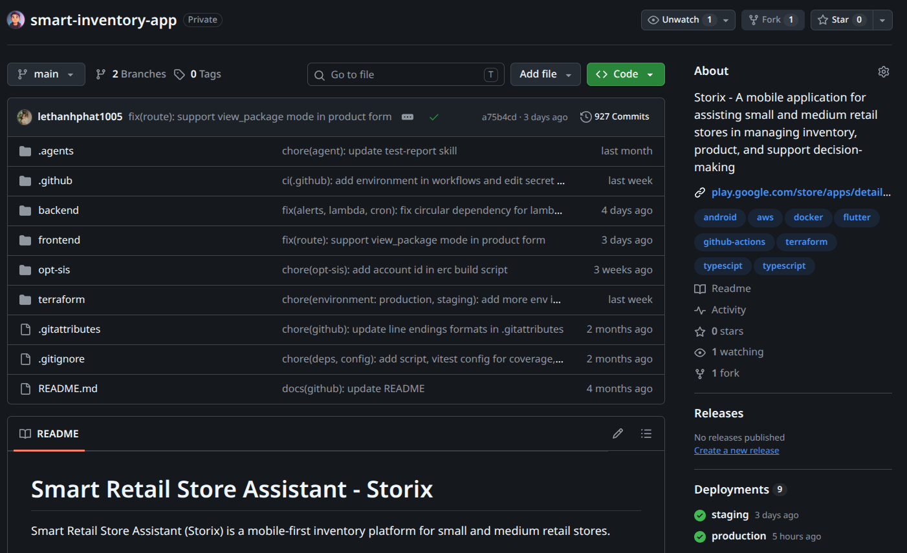

## Why Storix?

Managing inventory in small and medium-sized retail stores often involves repetitive data entry, manual stock tracking, and limited visibility into inventory changes.

Storix brings these workflows together in a mobile-first platform, allowing store operators to manage products, track inventory, record stock transactions, and receive alerts from a single application.

By combining barcode-first workflows, automated notifications, inventory insights, and AI-assisted features, Storix aims to make daily inventory operations faster, more consistent, and easier to manage.

## Screenshots / Demo

<p align="center">
  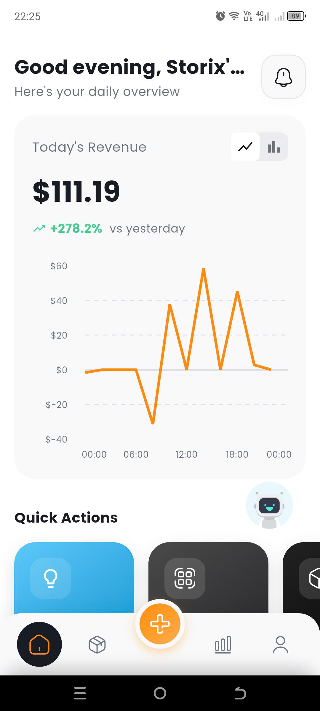
  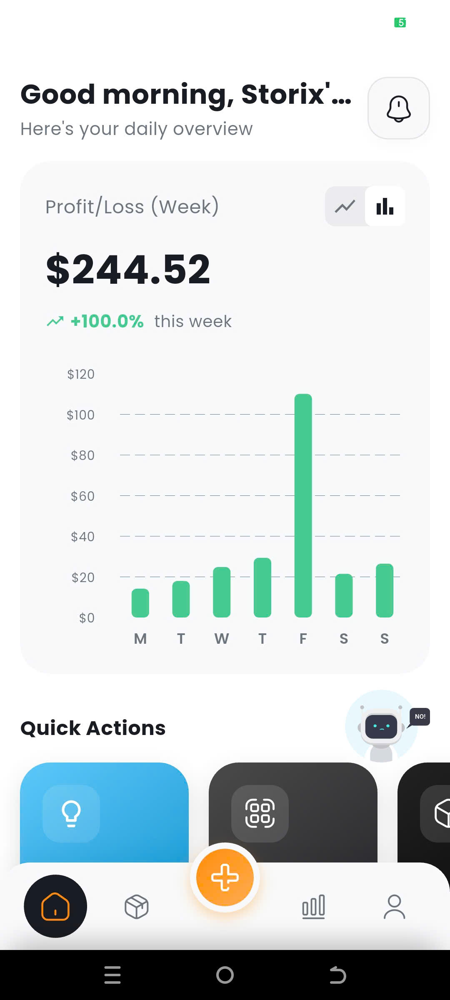
  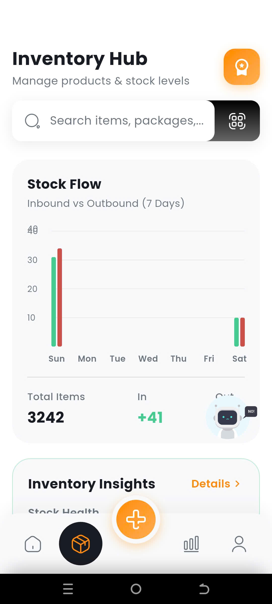
  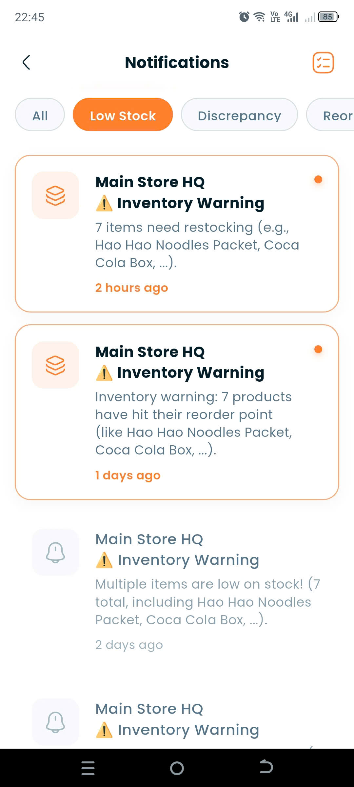
  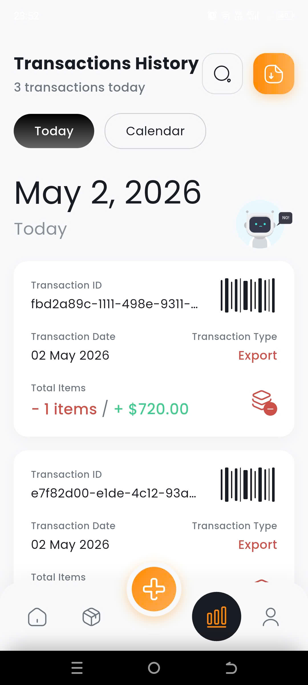
  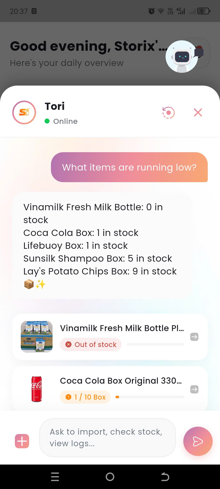
  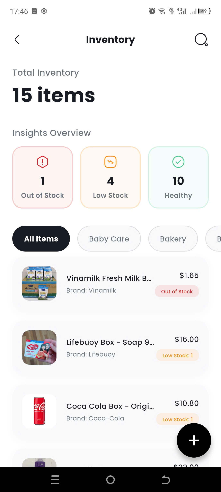
  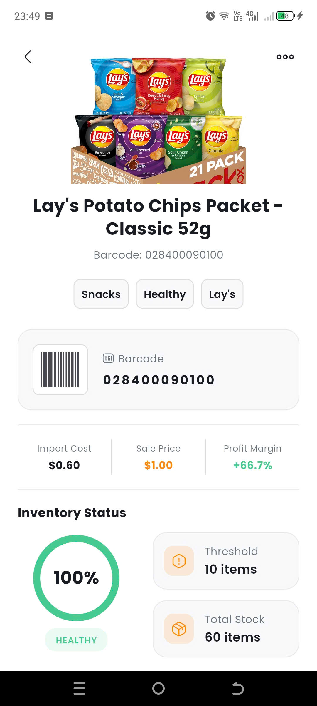
  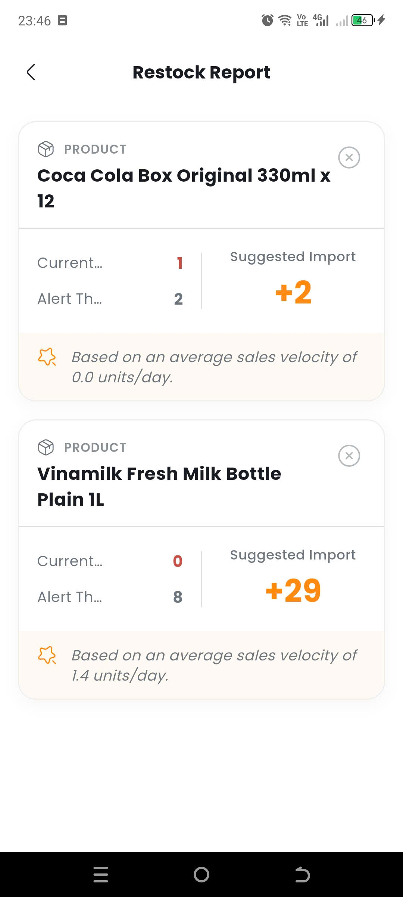
</p>

## Key Features

### Inventory Management
Provides essential tools to manage and monitor stock accurately across daily operations.

- Create import and export transactions
- Adjust inventory when discrepancies occur
- Track stock levels in real-time

### Product Management
Enables flexible and efficient product data management.

- Create, update, and delete products
- Create products quickly using barcode scanning
- Organize products with category management

### Barcode System
Optimizes data entry and product lookup using barcode-first workflows.

- Scan barcode to search or create products
- Cache external barcode API responses to reduce latency
- Map barcode values directly to product packages for fast reuse

### Notifications
Provides real-time alerts to help users respond proactively to inventory issues.

- Low stock warnings
- Reorder suggestions based on thresholds
- Detection of abnormal inventory discrepancies

### Smart Decision Support
Enhances decision-making with data-driven insights and AI-assisted features.

- Suggest optimal reorder quantities
- Identify fast-moving and slow-moving products
- Provide an inventory insights dashboard

### Chatbot:
Chatbot-ready mobile UI for future AI-assisted inventory queries and operational guidance.

- Answers inventory-related questions in natural language.
- Calls backend APIs to execute supported actions

## Tech Stack

| Area | Technologies |
| --- | --- |
| Mobile | Flutter, Dart |
| Backend | Node.js, TypeScript, Express.js |
| ORM | Prisma |
| Database | PostgreSQL |
| Backend Services | Supabase |
| Cache | Redis |
| Authentication | Supabase Auth |
| Push Notifications | Firebase Cloud Messaging |
| Cloud | AWS |
| Infrastructure | Terraform |
| CI/CD | GitHub Actions |
| Others | Bash |

## Deployment Infrastructure

<p align="center">
  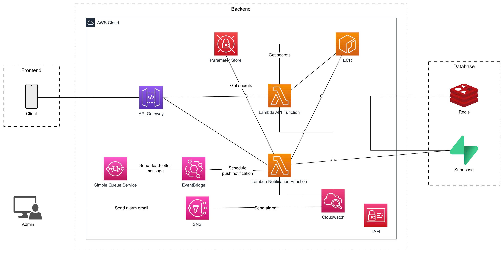
</p>

## Project Structure

```text
.
├── .agents/                         # Prompts to chatbot agent
│   ├── skills/
│   └── AGENTS.md
├── backend/
│   ├── src/
│   │   ├── app.ts                   # Express app factory and middleware setup
│   │   ├── server.ts                # HTTP server entry point
│   │   ├── express.d.ts
│   │   ├── common/                  # Shared backend utilities
│   │   ├── config/
│   │   ├── cron/                    # Scheduled cron jobs for push notification
│   │   ├── db/                      # Database connection instances
│   │   ├── lambda/                  # Handlers for Lambda functions
│   │   └── modules/                 # Feature modules (each follows route → controller → service → repository)
│   │       ├── alerts/
│   │       │   ├──controllers/  # Request handlers
│   │       │   ├──modules/      # Feature module definitions and dependency wiring
│   │       │   ├──repositories/ # Database access layer
│   │       │   ├──routes/       # Route registration
│   │       │   ├──services/     # Business logic
│   │       │   ├──dtos/         # Data transfer objects for request/response validation
│   │       │   ├──types/        # TypeScript types and interfaces
│   │       │   └──validators/   # Input validation schemas and rules
│   │       ├── audit-log/
│   │       ├── auth/
│   │       ├── barcode/
│   │       ├── categories/
│   │       ├── chat-bot/
│   │       └── ...
│   ├── prisma/                      # Prisma data model definitions
│   ├── supabase/                    # Supabase local development configuration
│   ├── tests/                       # Unit tests and intergration tests for backend modules
│   ├── Dockerfile                   # Docker image for EC2/container deployment
│   ├── Dockerfile.lambda            # Docker image optimized for AWS Lambda deployment
│   ├── package-lock.json
│   ├── package.json
│   └── tsconfig.json
│
├── frontend/
│   ├── lib/
│   │   ├── main.dart                # App entry point and initialization
│   │   ├── firebase_options.dart
│   │   ├── core/                    # Shared infrastructure used across all features
│   │   │   ├── infrastructure/
│   │   │   ├── state/ 
│   │   │   └── ui/
│   │   ├── features/                # Self-contained feature modules
│   │   │   ├── auth/
│   │   │   │   ├── bindings/    # Dependencie inject
│   │   │   │   ├── controllers/ # Handle screen logic
│   │   │   │   ├── models/      # Private models
│   │   │   │   ├── providers/   # Call API from backend
│   │   │   │   └── views/       # Main interface of the feature
│   │   │   ├── home/
│   │   │   ├── inventory/
│   │   │   ├── navigation/
│   │   │   ├── notification/
│   │   │   ├── transaction/
│   │   │   └── ...
│   │   └── routes/
│   ├── assets/
│   ├── android/
│   ├── ios/
│   ├── web/
│   ├── linux/
│   ├── macos/
│   ├── windows/
│   └── test/
│
├── terraform/                       # Infrastructure as Code (AWS)
│   ├── environments/                # Infrastructure environments
│   │   ├── production/
│   │   └── staging/
│   └── modules/                     # Reusable Terraform modules
│       ├── api_gateway/
│       ├── cloudwatch/
│       ├── ec2/
│       ├── ecr/
│       ├── event_bridge/
│       ├── iam/
│       ├── lambda/
│       ├── networking/
│       ├── route53/
│       ├── s3/
│       ├── sqs/
│       └── ssm_parameter/
│
├── opt-sis/                         # Self-hosted / on-premise deployment configuration
│   ├── nginx/
│   ├── scripts/
│   └── stacks/
│
└── .github/                         # GitHub Actions CI/CD configuration
    ├── workflows/
    │   ├── ci-backend.yml
    │   ├── ci-frontend.yml
    │   ├── cd-backend-ec2.yml
    │   ├── cd-backend-lambda.yml
    │   ├── backup.yml
    │   └── database-keep-alive.yml
    ├── actions/
    ├── ISSUE_TEMPLATE/
    └── CODEOWNERS
```

## Engineering Highlights

- Modular backend architecture with separated
  route, controller, service, and repository layers
- Type-safe backend development with strict TypeScript
- Prisma-based data access with PostgreSQL
- Barcode-first product workflows with API response caching
- Role-based store access control
- Infrastructure managed through Terraform
- Automated CI/CD with GitHub Actions
- Cloud-native deployment using AWS services
