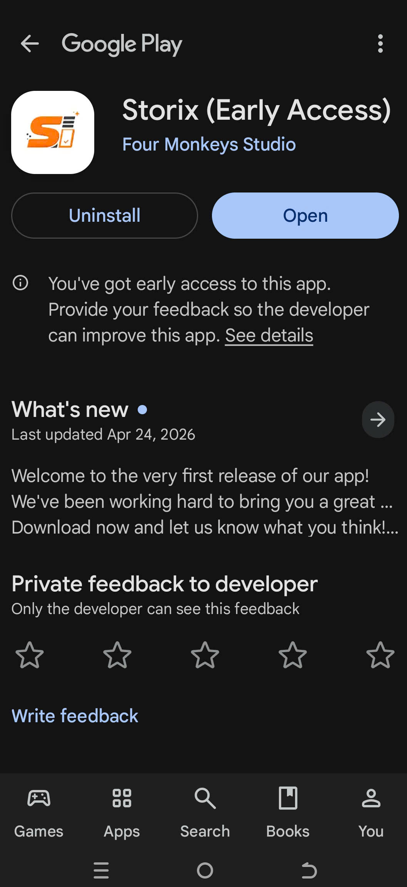
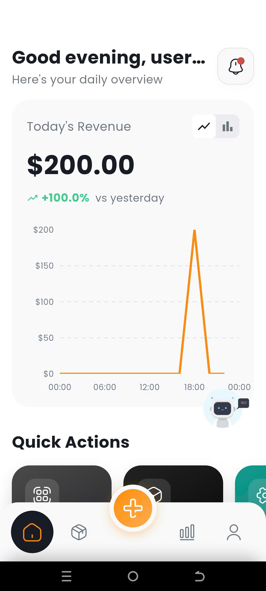
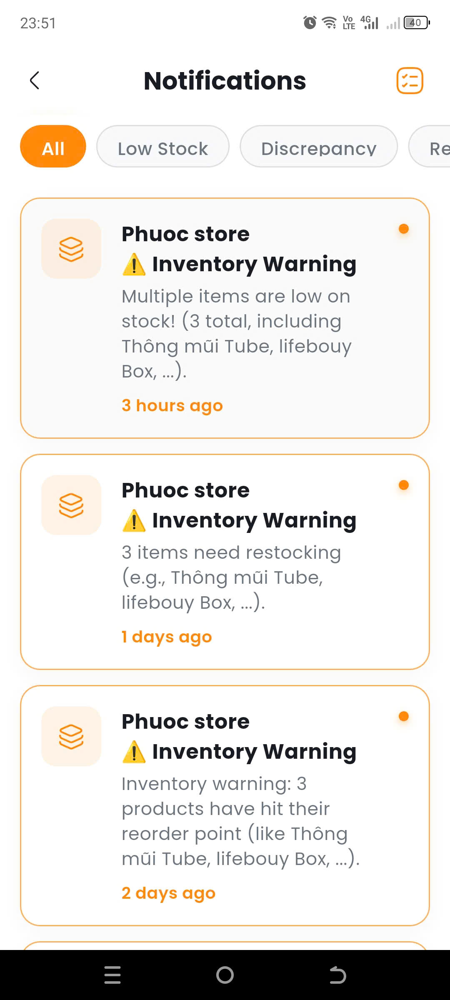
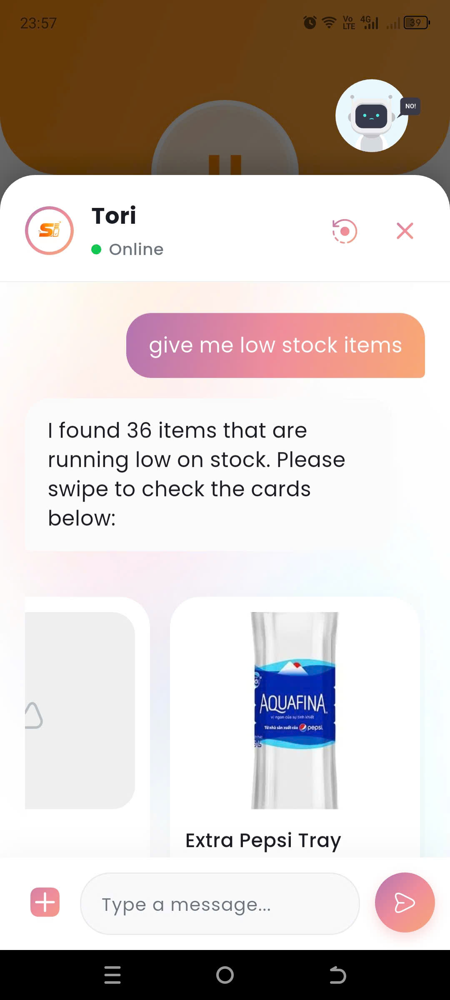
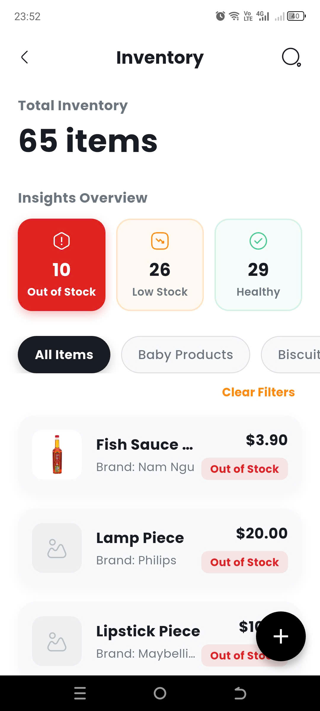

# Smart Retail Store Assistant - Storix

**Smart Retail Store Assistant (Storix)** is a mobile-first inventory platform for small and medium retail stores.

> **Note:** This is an overview README for the project. The source code is not publicly available as this is a closed-source project.

> **Coming Soon:** The app is currently being published to the Google Play Store. We will keep this page updated with the latest news.
>
> <p align="center"></p>

## Screenshots

<p align="center">
  
  
  
  
  
  
</p>

## Key Features

- Inventory management for import, export, stock adjustment, threshold tracking, and stock health visibility.
- Product and category management with support for product variants/packages, pricing, images, and unit-level inventory.
- Barcode-assisted workflows for searching products, attaching barcodes to packages, and accelerating transaction entry.
- Automated notifications for low-stock events using event-driven checks and scheduled background scans.
- Inventory insight and reporting screens for stock status, transaction history, and operational overview.
- Push notification support using Firebase Admin on the backend and Firebase Messaging on the mobile client.
- Chatbot-ready mobile UI for future AI-assisted inventory queries and operational guidance.

## Tech Stack

### Frontend

- Flutter
- Dart

### Backend

- Node.js
- TypeScript
- Express.js
- Prisma ORM
- PostgreSQL
- Supabase

### Others

- GitHub Actions
- Docker
- Terraform
- AWS
- Bash

## Project Structure

```text
backend/
  src/
    common/
    config/
    cron/
    db/
    generated/
    modules/
      auth/
      stores/
      categories/
      products/
      product-packages/
      inventories/
      transactions/
      notification/
      search/
      ...
  prisma/
  supabase/
  terraform/ # Terraform code for AWS infrastructure
  scripts/   # Deploy scripts & docker swarm yml for EC2 instance
  README.md
frontend/
  lib/
    core/
      infrastructure/
      state/
      ui/
    features/
      auth/
      inventory/
      transaction/
      notification/
      report/
      search/
      workspace/
      ...
    routes/
  assets/
  android/
  ios/
  web/
docs/
```

## Key Features in Details

### Inventory Management
Provides essential tools to manage and monitor stock accurately across daily operations.

- Create import and export transactions
- Adjust inventory when discrepancies occur
- Track stock levels in real-time

### Product Management
Enables flexible and efficient product data management.

- Create, update, and delete products
- Create products quickly using barcode scanning
- Organize products with category management

### Barcode System
Optimizes data entry and product lookup using barcode-first workflows.

- Scan barcode to search or create products
- Cache external barcode API responses to reduce latency
- Map barcode values directly to product packages for fast reuse

### Notifications
Provides real-time alerts to help users respond proactively to inventory issues.

- Low stock warnings
- Reorder suggestions based on thresholds
- Detection of abnormal inventory discrepancies

### Smart Decision Support
Enhances decision-making with data-driven insights and AI-assisted features.

- Suggest optimal reorder quantities
- Identify fast-moving and slow-moving products
- Provide an inventory insights dashboard
- LLM-based chatbot that:
  - Answers inventory-related questions in natural language
  - Calls backend APIs to execute supported actions

## Setup and Installation

### Prerequisites

- Node.js 18+
- npm
- Flutter SDK
- Dart SDK
- Android Studio or VS Code with Flutter tooling
- Docker Desktop

### Backend setup

```bash
cd backend
npm install
npx supabase start
npx supabase status
```

If you want push notifications in local development, place `serviceAccountKey.json` in the `backend/` directory for Firebase Admin initialization.

Run database setup:

```bash
cd backend
npx prisma migrate dev
npx prisma generate
```

Start the backend:

```bash
cd backend
npm run dev
```

The server starts on `http://localhost:3000` and exposes a health check at `/api/health`.

### Frontend setup

```bash
cd frontend
flutter pub get
```

The frontend reads runtime configuration from compile-time Dart defines rather than a checked-in `.env` file. Start the app with values that match your environment:

```bash
cd frontend
flutter run ^
  --dart-define=API_BASE_URL=http://10.0.2.2:3000 ^
  --dart-define=SUPABASE_URL=http://10.0.2.2:54321 ^
  --dart-define=SUPABASE_ANON_KEY=<publishable_key_from_supabase_status>
```

Notes:

- `10.0.2.2` is appropriate for the Android emulator. Use your machine IP or `localhost` depending on the target platform.
- Firebase is initialized in the app, so platform-specific Firebase configuration must also be valid if notification features are enabled.

### Development workflow

Start both applications in separate terminals:

```bash
cd backend
npm run dev
```

```bash
cd frontend
flutter run --dart-define=API_BASE_URL=http://10.0.2.2:3000 --dart-define=SUPABASE_URL=http://10.0.2.2:54321 --dart-define=SUPABASE_ANON_KEY=<publishable_key_from_supabase_status>
```

## Environment Variables

### Backend

| Variable | Required | Purpose |
| --- | --- | --- |
| `DATABASE_URL` | Yes | PostgreSQL connection string used by Prisma |
| `SUPABASE_URL` | Yes | Supabase project/local API URL |
| `SUPABASE_SERVICE_ROLE_KEY` | Yes | Backend admin access for storage and protected Supabase operations |
| `SUPABASE_ANON_KEY` | Recommended | Useful for local setup parity and shared Supabase configuration |
| `STORAGE_BUCKET` | No | Supabase storage bucket subfoler name for product images, defaults to `images` |
| `NODE_ENV` | No | Logging/runtime mode |

## Notes

- Storix is built for retail inventory support, especially stores that need fast daily operations on mobile devices.
- Smart features in this project are designed to assist store decisions through automation, alerts, and guided workflows rather than replace business rules.
- The backend remains the source of truth for validation, authorization, store scoping, and inventory consistency.
